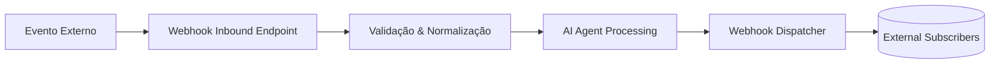

# 📡 Webhook I/O Module for White-Label AI Agents (PHP)

Um módulo completo para **envio (outbound)** e **recebimento (inbound)** de dados via **webhooks**, projetado para integrar agentes de IA whitelabel desenvolvidos em PHP.  
A solução é modular, segura e compatível com **SQLite, MySQL e PostgreSQL**.

---

## #️⃣ 1. Overview
O módulo permite que o agente de IA:

- **Receba eventos externos** via POST (webhook inbound).
- **Envie callbacks** para URLs configuradas (webhook outbound).
- Valide assinaturas com HMAC.
- Registre logs detalhados.
- Suporte múltiplos assinantes.
- Funcione com filas opcionais.
- Trabalhe de forma síncrona ou assíncrona.

---

## #️⃣ 2. Core Capabilities

### ✔ Inbound Webhooks (Recebimento)
- Endpoint configurável.
- Aceita JSON.
- Validação de HMAC (opcional).
- Normalização do payload.
- Disparo do agente de IA baseado no evento.
- Respostas síncronas ou via fila.

### ✔ Outbound Webhooks (Envio)
- Fan-out para vários assinantes.
- Assinatura com HMAC.
- Reintentos com backoff exponencial.
- Logs de requisição/resposta.
- Timeout configurável.

---

## #️⃣ 3. Data Flow


---

## #️⃣ 4. Inbound Webhook Specification

### 📍 Endpoint

```
POST /webhook/inbound
Content-Type: application/json
```

### Payload Exemplo

```json
{
  "event": "order.created",
  "timestamp": 1731602712,
  "data": { "order_id": "A12345" },
  "signature": "sha256=xxxx"
}
```

### Validação

* `Content-Type` deve ser JSON.
* Tolerância de timestamp ajustável.
* Assinatura via:

```php
hash_hmac('sha256', $body, $secret);
```

### Respostas

```json
{ "status": "received" }
```

Erros:

```json
{ "error": "invalid_signature" }
```

---

## #️⃣ 5. Outbound Webhook Specification

### Lista de Destinatários

```json
[
  {
    "url": "https://api.cliente.com/callback",
    "secret": "client-secret",
    "events": ["ai.response", "order.updated"]
  }
]
```

### Corpo Enviado

```json
{
  "event": "ai.response",
  "timestamp": 1731603333,
  "data": { "message": "Processed" }
}
```

### Headers

```
X-Agent-Signature: sha256=xxxx
X-Agent-ID: agent_123
User-Agent: AI-Agent-Webhook/1.0
```

### Retry Policy

* Até 6 tentativas
* Backoff exponencial (1s, 5s, 30s, 2min, ...)
* Registros individuais por tentativa

---

## #️⃣ 6. Security Model

### 🔐 HMAC Signature

* Evita spoofing.
* Garante integridade do payload.

### ⏱ Anti-Replay

* Timestamps aceitos apenas dentro da janela definida.

### 🛡 Whitelisting

* Aceita whitelists de IP ou ASN.

---

## #️⃣ 7. PHP Implementation

### 📥 inbound_webhook.php

```php
<?php

$body = file_get_contents("php://input");
$payload = json_decode($body, true);

// Validate signature
$secret = "CLIENT_SECRET";
$expected = "sha256=" . hash_hmac("sha256", $body, $secret);

if (!hash_equals($expected, $_SERVER["HTTP_X_SIGNATURE"] ?? "")) {
    http_response_code(401);
    echo json_encode(["error" => "invalid_signature"]);
    exit;
}

process_ai_agent($payload["event"], $payload["data"]);

echo json_encode(["status" => "received"]);
```

---

### 📤 webhook_dispatcher.php

```php
<?php

function dispatch_webhook($url, $event, $data, $secret) {
    $body = json_encode([
        "event" => $event,
        "timestamp" => time(),
        "data" => $data
    ]);

    $signature = "sha256=" . hash_hmac("sha256", $body, $secret);

    $ch = curl_init($url);

    curl_setopt_array($ch, [
        CURLOPT_POST => true,
        CURLOPT_POSTFIELDS => $body,
        CURLOPT_HTTPHEADER => [
            "Content-Type: application/json",
            "X-Agent-Signature: $signature",
            "User-Agent: AI-Agent-Webhook/1.0"
        ],
        CURLOPT_RETURNTRANSFER => true,
        CURLOPT_TIMEOUT => 5
    ]);

    $response = curl_exec($ch);
    $status = curl_getinfo($ch, CURLINFO_HTTP_CODE);
    curl_close($ch);

    return [$status, $response];
}
```

---

## #️⃣ 8. Database Model

### Compatível com:

* **SQLite** (standalone, ideal para whitelabel e multi-instância)
* **MySQL**
* **PostgreSQL**

---

### **Tabela: webhook_subscribers**

#### SQLite

```sql
CREATE TABLE webhook_subscribers (
    id TEXT PRIMARY KEY,
    client_id TEXT NOT NULL,
    url TEXT NOT NULL,
    secret TEXT NOT NULL,
    events TEXT NOT NULL, -- JSON string
    active INTEGER NOT NULL DEFAULT 1
);
```

#### MySQL

```sql
CREATE TABLE webhook_subscribers (
    id CHAR(36) PRIMARY KEY,
    client_id CHAR(36) NOT NULL,
    url TEXT NOT NULL,
    secret TEXT NOT NULL,
    events JSON NOT NULL,
    active BOOLEAN NOT NULL DEFAULT TRUE
);
```

#### PostgreSQL

```sql
CREATE TABLE webhook_subscribers (
    id UUID PRIMARY KEY,
    client_id UUID NOT NULL,
    url TEXT NOT NULL,
    secret TEXT NOT NULL,
    events JSONB NOT NULL,
    active BOOLEAN NOT NULL DEFAULT TRUE
);
```

---

### **Tabela: webhook_logs**

#### SQLite

```sql
CREATE TABLE webhook_logs (
    id TEXT PRIMARY KEY,
    subscriber_id TEXT NOT NULL,
    event TEXT NOT NULL,
    request_body TEXT NOT NULL,
    response_code INTEGER,
    response_body TEXT,
    attempts INTEGER NOT NULL DEFAULT 1,
    created_at TEXT NOT NULL
);
```

#### MySQL

```sql
CREATE TABLE webhook_logs (
    id CHAR(36) PRIMARY KEY,
    subscriber_id CHAR(36) NOT NULL,
    event TEXT NOT NULL,
    request_body JSON NOT NULL,
    response_code INT,
    response_body TEXT,
    attempts INT NOT NULL DEFAULT 1,
    created_at TIMESTAMP NOT NULL DEFAULT CURRENT_TIMESTAMP
);
```

#### PostgreSQL

```sql
CREATE TABLE webhook_logs (
    id UUID PRIMARY KEY,
    subscriber_id UUID NOT NULL,
    event TEXT NOT NULL,
    request_body JSONB NOT NULL,
    response_code INT,
    response_body TEXT,
    attempts INT NOT NULL DEFAULT 1,
    created_at TIMESTAMP NOT NULL DEFAULT NOW()
);
```

---

## #️⃣ 9. Configuration Options

```yaml
webhooks:
  inbound:
    enabled: true
    path: "/webhook/inbound"
    validate_signature: true
    max_clock_skew: 120

  outbound:
    retries: 6
    timeout: 5
    concurrency: 10
```

---

## #️⃣ 10. Extensibility

* Suporte a Redis, SQS, RabbitMQ.
* Transformações personalizadas de payload.
* Múltiplos agentes por cliente.
* Dashboard de monitoramento.
* Sandbox de testes de webhook.
* Suporte opcional a Webhook Signing V2 (Stripe-style).

---
